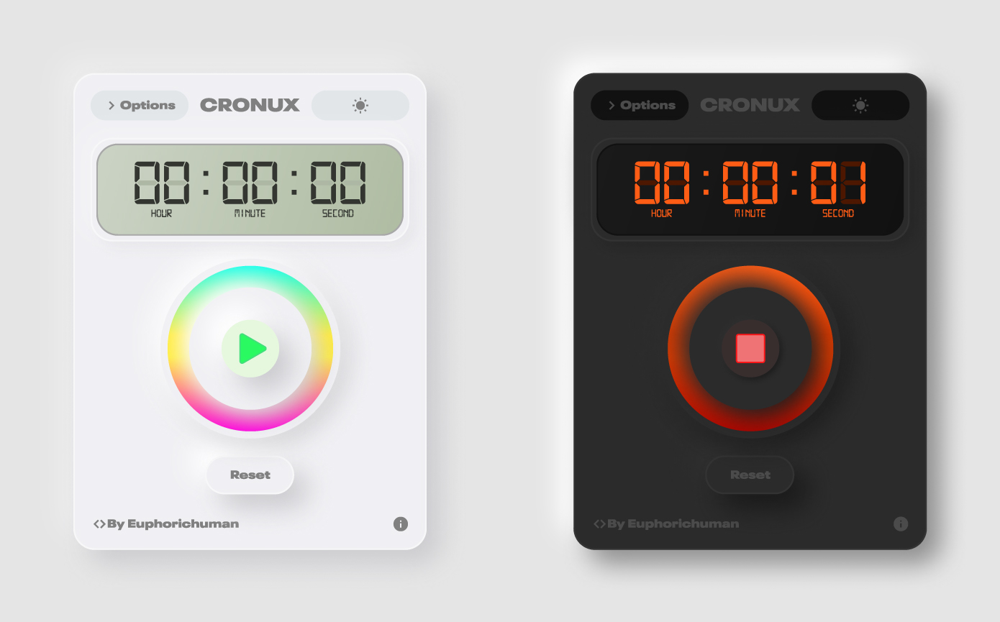

# CRONUX (Clock, stopwatch and timer)

Implementation of a clock, stopwatch, and timer web with Neumorphism GUI (Javascript, CSS and html5).

### Built with:

- [Html5](https://html.spec.whatwg.org/multipage/)
- [CSS](https://www.w3.org/TR/CSS1/)
- [Vanilla Js](https://developer.mozilla.org/en-US/docs/Web/JavaScript)

## Neumorphism UI docs

### Documentation used in this project:

- [Neumorphism in user interfaces](https://uxdesign.cc/neumorphism-in-user-interfaces-b47cef3bf3a6)

### Neumorphism generator:

- [Neumorphism.io](https://neumorphism.io/#e0e0e0)

## Contributions

All **Pull Requests** are welcome. For major changes, please open an issue first to discuss what you would like to change.

Be sure to update the tests accordingly.

## Authors

This design and implementation was created by was created by:

- [Martin Fuentes](https://github.com/Euphorichuman)

## License

This project is under  MIT License. See the [LICENSE](docs/LICENSE) file for more details.

[MIT License](https://opensource.org/licenses/MIT)

## Inspired by

- [Skeuomorph Mobile Banking](https://dribbble.com/shots/8297803-Skeuomorph-Mobile-Banking-Continuation)